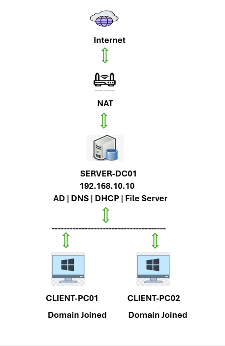

# Enterprise IT Help Desk Lab

## Project Overview

This project demonstrates the design, implementation, administration, and troubleshooting of a Windows Server enterprise environment. The lab was built to simulate a real-world corporate network and showcase hands-on IT Support, Help Desk, and System Administration skills.

The environment includes Active Directory Domain Services, DNS, DHCP, Group Policy, File Sharing, NTFS Permissions, PowerShell Automation, and common Help Desk troubleshooting scenarios.

---

## Business Scenario

A fictional company, TechSolutions, requires a centralized Windows Server infrastructure to manage employees, computers, security policies, file access, and network services.

As the IT Administrator, I was responsible for:

- Deploying and configuring Windows Server 2022
- Creating and managing Active Directory users and groups
- Configuring DNS and DHCP services
- Joining client computers to the domain
- Managing file shares and permissions
- Implementing Group Policies
- Automating administrative tasks using PowerShell
- Troubleshooting common IT support issues

---

## Lab Environment

### Server

| Component | Configuration |
|------------|------------|
| Server Name | SERVER-DC01 |
| Operating System | Windows Server 2022 |
| Roles Installed | Active Directory, DNS, DHCP, File Services |
| IP Address | 192.168.10.10 |

### Clients

| Computer Name | Description |
|------------|------------|
| CLIENT-PC01 | Domain Joined Workstation |
| CLIENT-PC02 | Domain Joined Workstation |

### Network

| Item | Value |
|------------|------------|
| Domain Name | techsolutions.local |
| Network | 192.168.10.0/24 |
| DNS Server | 192.168.10.10 |
| DHCP Scope | 192.168.10.100 - 192.168.10.200 |

---

## Network Diagram

---

## Technologies Used

- Windows Server 2022
- Active Directory Domain Services (AD DS)
- DNS
- DHCP
- Group Policy
- NTFS Permissions
- File Sharing
- PowerShell
- VirtualBox
- Windows 11 Pro

---

## Active Directory Configuration

### Organizational Units

- TechSolutions
- IT
- HR
- Finance
- Users
- Computers

### Security Groups

- IT-Team
- HR-Team
- Finance-Team

### User Accounts

Created and managed multiple employee accounts including:

- john.admin
- mary.hr
- david.finance
- sarah.it

---

## DHCP Configuration

Configured DHCP services to automatically assign IP addresses to client computers.

### Scope Configuration

| Setting | Value |
|------------|------------|
| Scope Name | CorpNet Scope |
| Start IP | 192.168.10.100 |
| End IP | 192.168.10.200 |
| Subnet Mask | 255.255.255.0 |

---

## File Sharing and Access Control

Created departmental file shares:

- HR
- Finance
- IT

Configured:

- Share Permissions
- NTFS Permissions
- Security Group Access Controls

Users were granted access only to authorized departmental resources.

---

## Group Policy Configuration

Implemented security-focused Group Policies including:

- Password Complexity Requirements
- Minimum Password Length
- Account Lockout Policy
- Password Expiration Policy

---

## PowerShell Automation

Developed administrative scripts to automate common IT Support tasks.

### Scripts Included

#### System Information Script

Collects:

- Computer Name
- Operating System
- RAM
- Processor
- IP Address

#### Bulk User Creation Script

Automates onboarding of Active Directory users.

#### Network Diagnostics Script

Performs:

- IP Configuration Checks
- Connectivity Testing
- DNS Resolution Testing

#### Active Directory Password Reset & Audit Automation

Features:

- Secure password generation
- Password reset automation
- Account unlock automation
- Password change enforcement
- Audit logging
- Error handling

---

## Troubleshooting Scenarios

### Account Lockout Resolution

- Simulated user account lockout
- Unlocked account
- Reset password
- Restored access

### DNS Troubleshooting

- Simulated DNS misconfiguration
- Diagnosed issue using command-line tools
- Restored DNS functionality

### DHCP Troubleshooting

- Simulated incorrect IP configuration
- Diagnosed network connectivity issues
- Restored DHCP functionality

### File Share Access Troubleshooting

- Investigated permission errors
- Verified security groups
- Corrected access permissions

---

## Skills Demonstrated

### Windows Administration

- Active Directory Administration
- DNS Management
- DHCP Administration
- Group Policy Management
- File Server Administration

### IT Support

- User Account Management
- Password Resets
- Account Unlocks
- Troubleshooting
- Incident Resolution

### Networking

- IP Addressing
- DNS Troubleshooting
- DHCP Troubleshooting
- Connectivity Testing

### PowerShell

- Automation
- Active Directory Scripting
- Audit Logging
- Administrative Tools

---

## Screenshots

### Active Directory

(Add Screenshot)

### DHCP Configuration

(Add Screenshot)

### DNS Configuration

(Add Screenshot)

### Group Policy

(Add Screenshot)

### Domain Joined Clients

(Add Screenshot)

### PowerShell Automation

(Add Screenshot)

---

## Lessons Learned

Through this project, I gained hands-on experience deploying and managing a Windows Server enterprise environment. The project strengthened my skills in Active Directory administration, networking, troubleshooting, security management, and PowerShell automation while simulating real-world IT Support responsibilities.

---

## Author

Boyede Oyewale Oyeyanju

Bachelor of Applied Technology – BYU-Idaho

Areas of Interest:

- IT Support
- System Administration
- Data Analysis
- Networking
- Microsoft Technologies
- PowerShell Automation
